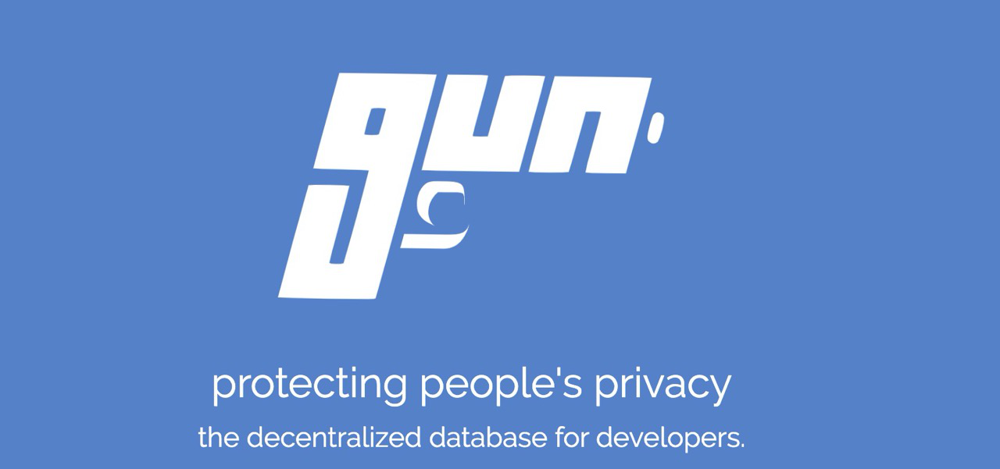

# gun.eco
Scalable Multilanguage Application for gun.eco

## ScreenShoot



## Features
* Built on Node.js, Express.js and Gun
* Vanilla JavaScript / No Frameworks
* Own Virtual dOM / No react
* Multilingual EN / ES (scalable)
* PWA - Progressive Web APP
* Offline First
* Scroll line and scroll top module
* Descentralized & P2P by GUN
* Based on "Keep it simple" concept

## Installation
```
git clone https://github.com/estebanrfp/gun.eco
npm install
npm run dev
```

## Considerations

Creating high-performance applications that solves complex problems requires full dedication from the developers. documentation, portability, bug fixes, infrastructure, user experience, and support.

if it ain't broke, don't fix it.
